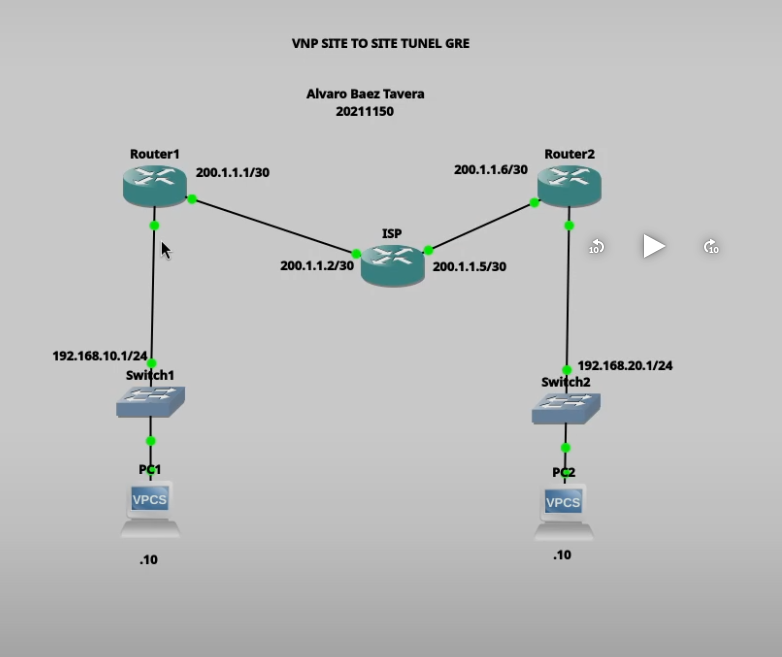

# VPN Site-to-Site con Túnel GRE sobre IPSec (IKEv1)

## Descripción

Esta práctica consiste en la implementación de una VPN Site-to-Site utilizando un túnel GRE protegido mediante IPSec con IKEv1. GRE permite transportar múltiples protocolos y facilita el uso de protocolos de enrutamiento dinámico, mientras que IPSec proporciona confidencialidad, integridad y autenticación del tráfico que circula por el túnel.

---

# Objetivo

Implementar una VPN Site-to-Site utilizando un túnel GRE protegido con IPSec (IKEv1), permitiendo la comunicación segura entre dos redes LAN ubicadas en diferentes sedes a través de una red pública.

---

# Topología



La topología está compuesta por:

- Router 1
- Router ISP
- Router 2
- Switch LAN 1
- Switch LAN 2
- PC1
- PC2

---

# Direccionamiento IP

## Router 1

| Interfaz | Dirección |
|----------|-----------|
| GigabitEthernet0/0 | 200.1.1.1/30 |
| GigabitEthernet0/1 | 192.168.10.1/24 |
| Tunnel0 | 10.10.10.1/30 |

---

## ISP

| Interfaz | Dirección |
|----------|-----------|
| GigabitEthernet0/0 | 200.1.1.2/30 |
| GigabitEthernet0/1 | 200.1.1.5/30 |

---

## Router 2

| Interfaz | Dirección |
|----------|-----------|
| GigabitEthernet0/0 | 200.1.1.6/30 |
| GigabitEthernet0/1 | 192.168.20.1/24 |
| Tunnel0 | 10.10.10.2/30 |

---

## Equipos finales

### PC1

IP: 192.168.10.10/24

Gateway: 192.168.10.1

### PC2

IP: 192.168.20.10/24

Gateway: 192.168.20.1

---

# Parámetros utilizados

| Parámetro | Valor |
|-----------|-------|
| Tipo VPN | GRE sobre IPSec |
| IKE | Version 1 |
| Encriptación | AES |
| Hash | SHA |
| Autenticación | Pre-Shared Key |
| Clave Compartida | cisco123 |
| Grupo DH | 2 |
| Lifetime | 86400 segundos |
| Transform Set | ESP-AES + ESP-SHA-HMAC |
| Modo IPSec | Transport |

---

# Configuración Router 1

```cisco
interface Tunnel0
 ip address 10.10.10.1 255.255.255.252
 tunnel source GigabitEthernet0/0
 tunnel destination 200.1.1.6

ip route 192.168.20.0 255.255.255.0 Tunnel0

crypto isakmp policy 10
 encr aes
 hash sha
 authentication pre-share
 group 2
 lifetime 86400

crypto isakmp key cisco123 address 200.1.1.6

crypto ipsec transform-set VPNSET esp-aes esp-sha-hmac
 mode transport

access-list 101 permit gre host 200.1.1.1 host 200.1.1.6

crypto map VPNMAP 10 ipsec-isakmp
 set peer 200.1.1.6
 set transform-set VPNSET
 match address 101

interface GigabitEthernet0/0
 crypto map VPNMAP
```

---

# Configuración Router 2

```cisco
interface Tunnel0
 ip address 10.10.10.2 255.255.255.252
 tunnel source GigabitEthernet0/0
 tunnel destination 200.1.1.1

ip route 192.168.10.0 255.255.255.0 Tunnel0

crypto isakmp policy 10
 encr aes
 hash sha
 authentication pre-share
 group 2
 lifetime 86400

crypto isakmp key cisco123 address 200.1.1.1

crypto ipsec transform-set VPNSET esp-aes esp-sha-hmac
 mode transport

access-list 101 permit gre host 200.1.1.6 host 200.1.1.1

crypto map VPNMAP 10 ipsec-isakmp
 set peer 200.1.1.1
 set transform-set VPNSET
 match address 101

interface GigabitEthernet0/0
 crypto map VPNMAP
```

---

# Configuración ISP

El router ISP únicamente proporciona conectividad entre ambos routers mediante enlaces punto a punto y no participa en el establecimiento del túnel VPN.

---

# Funcionamiento

El túnel GRE encapsula el tráfico entre las redes privadas, mientras que IPSec protege dicho túnel mediante cifrado y autenticación.

Cuando un equipo de la LAN 192.168.10.0/24 envía tráfico hacia la LAN 192.168.20.0/24:

1. El paquete entra al túnel GRE.
2. GRE encapsula el tráfico.
3. IPSec cifra el paquete GRE.
4. El paquete atraviesa la red pública.
5. Router 2 descifra IPSec.
6. Router 2 elimina el encabezado GRE.
7. El paquete llega a la LAN remota.

---

# Evidencias

## Topología

**Captura pendiente**

```
capturas/topologia.png
```

---

## Comunicación entre LANs

**Captura pendiente**

```
capturas/ping-lan-a-lan.png
```

La comunicación fue validada realizando un ping desde la PC1 (192.168.10.10) hacia la PC2 (192.168.20.10), comprobando el correcto funcionamiento del túnel GRE protegido mediante IPSec.

---

# Verificación

Durante la práctica se verificó el estado del túnel utilizando:

```bash
show interface Tunnel0
```

También se comprobó el establecimiento de IPSec mediante:

```bash
show crypto isakmp sa

show crypto ipsec sa
```

---

# Video demostrativo

La demostración del funcionamiento de la VPN GRE sobre IPSec se encuentra disponible en el siguiente enlace:

https://youtu.be/NZGDCBhv5vI

---

# Autor

**Alvaro Baez Tavera**

Matrícula:

**20211150**

ITLA - Ciberseguridad
